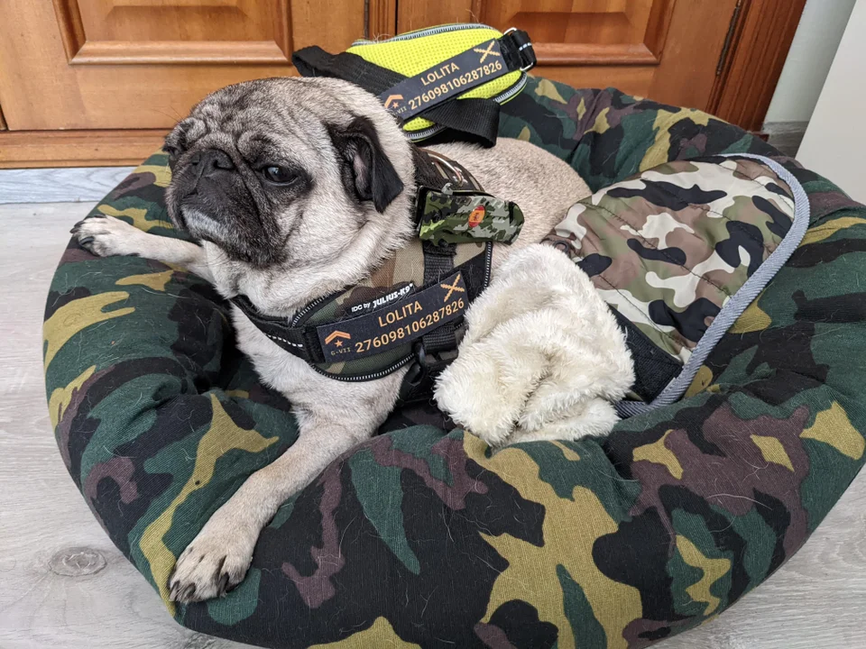
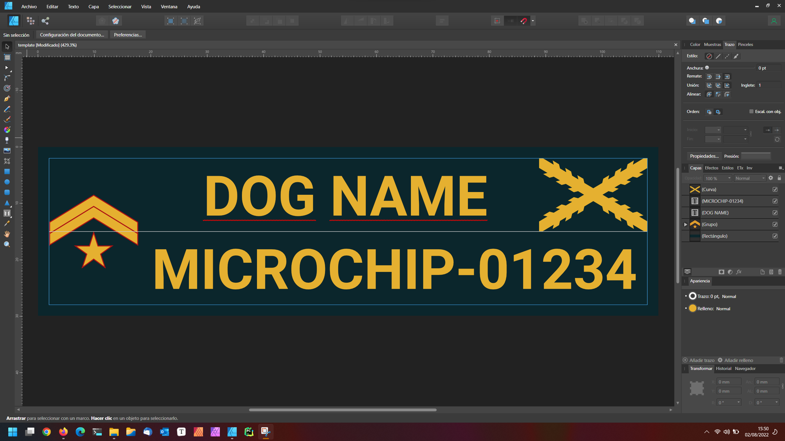
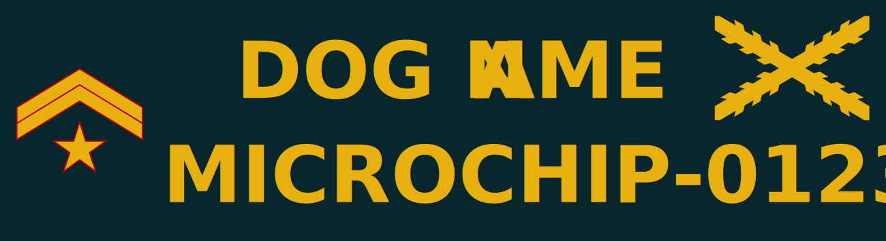
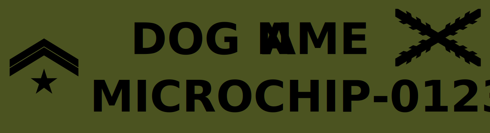
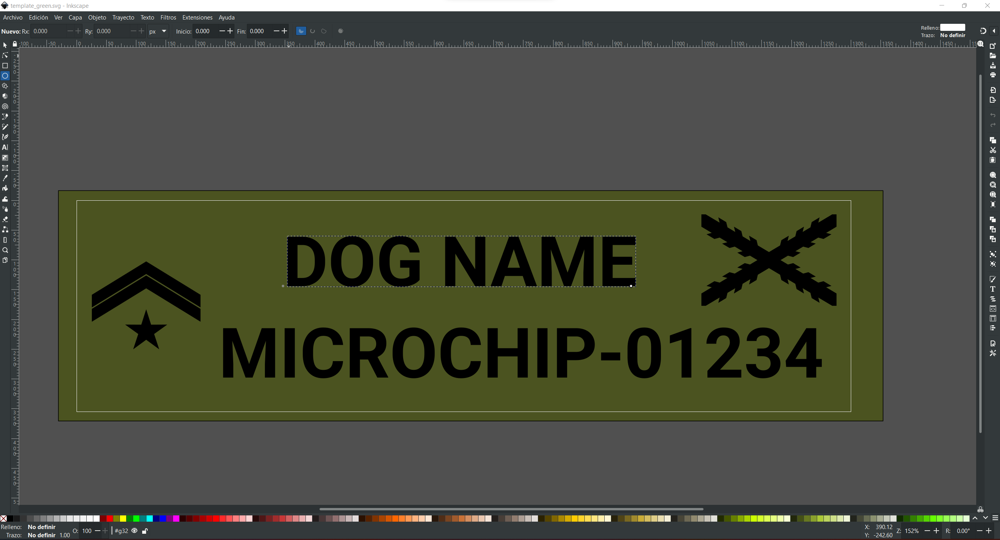

# juliusk9-patches
Template for custom printing Julius K9 patches for your small dog 

## Sizes for printing

11 x 3 cm
16 x 5 cm

## Margins

It is necessary to leave a few margins on the sides as this is where it will wear a lot with friction, 2 mm is usually adequate.

### Navy variant

### Camouflage variant

## How to edit?

If you don't want to use Photoshop (PSD attached) or Affinity Dessigner (template attached) you have the SVG format.

The SVG can be edited with [Inkscape](https://inkscape.org/es/) which is a free vector design program.

